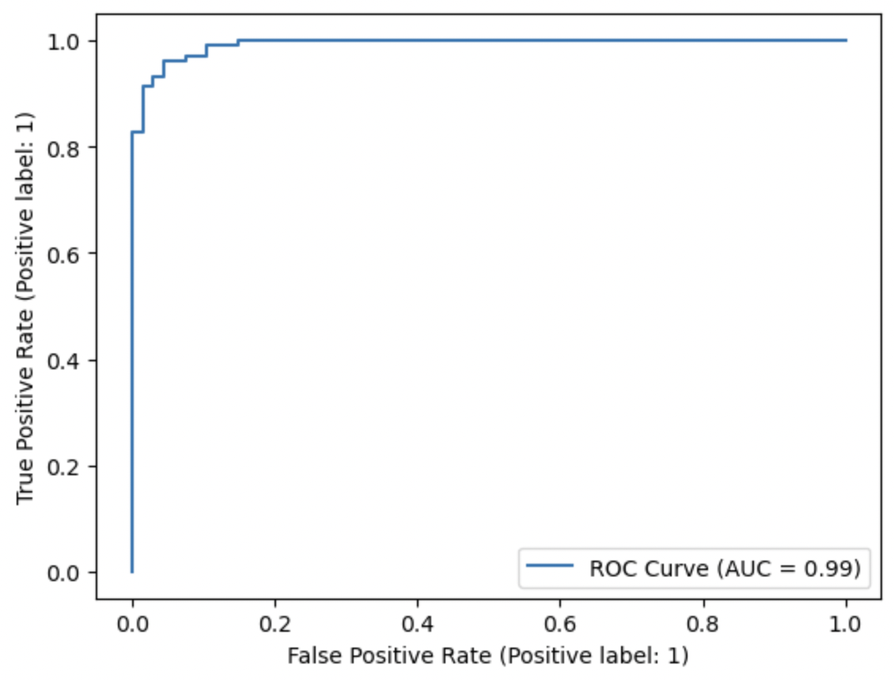
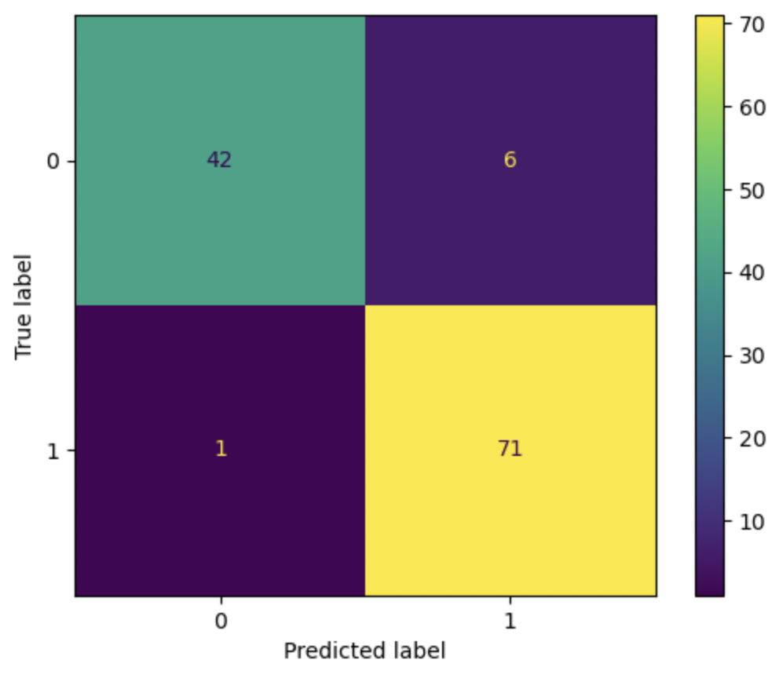

# Breast Cancer Detection with Supervised Learning

Trained models to classify tumors as malignant or benign using the Wisconsin Diagnostic dataset.

## Models Used
- Logistic Regression
- Decision Tree
- Support Vector Machine (SVM)

## Results
- Best model (SVM) achieved **94% test accuracy**
- Evaluated using ROC curves and confusion matrices

  
  

  <em>Figure 1: ROC Curve (left) and Confusion Matrix (right)</em>

## Tools & Libraries
Python, scikit-learn, NumPy, Matplotlib
