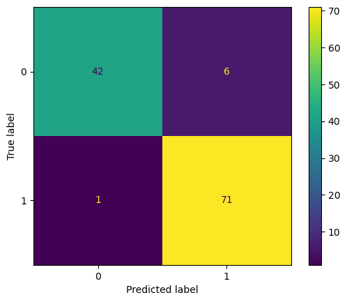

# Breast Cancer Detection using Supervised Learning

Trained models to classify tumors as malignant or benign using the Wisconsin Diagnostic dataset. 

This project gave me hands-on experience applying supervised learning to real-world problems. It deepened my understanding of how to evaluate models beyond accuracy and think critically about reliability in sensitive applications like healthcare.

## Models Used
- Logistic Regression
- Decision Tree
- Support Vector Machine (SVM)

## Results
- Best model (SVM) achieved **94% test accuracy**
- Evaluated using ROC curves and confusion matrices

  
  

  <em>Figure 1: ROC Curve (left) and Confusion Matrix (right)</em>

